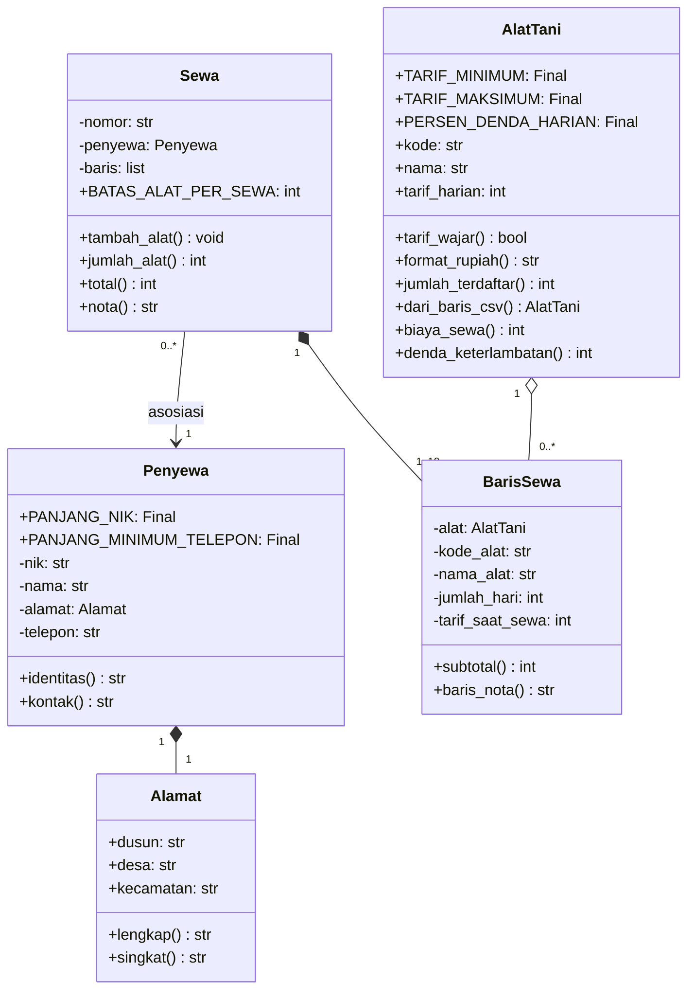

# Diagram Kelas P05

```mermaid
classDiagram
    class Alamat {
        +dusun: str
        +desa: str
        +kecamatan: str
        +lengkap() str
        +singkat() str
    }

    class Penyewa {
        +PANJANG_NIK: Final
        +PANJANG_MINIMUM_TELEPON: Final
        -nik: str
        -nama: str
        -alamat: Alamat
        -telepon: str
        +identitas() str
        +kontak() str
    }

    class AlatTani {
        +TARIF_MINIMUM: Final
        +TARIF_MAKSIMUM: Final
        +PERSEN_DENDA_HARIAN: Final
        +kode: str
        +nama: str
        +tarif_harian: int
        +tarif_wajar() bool
        +format_rupiah() str
        +jumlah_terdaftar() int
        +dari_baris_csv() AlatTani
        +biaya_sewa() int
        +denda_keterlambatan() int
    }

    class BarisSewa {
        -alat: AlatTani
        -kode_alat: str
        -nama_alat: str
        -jumlah_hari: int
        -tarif_saat_sewa: int
        +subtotal() int
        +baris_nota() str
    }

    class Sewa {
        -nomor: str
        -penyewa: Penyewa
        -baris: list
        +BATAS_ALAT_PER_SEWA: int
        +tambah_alat() void
        +jumlah_alat() int
        +total() int
        +nota() str
    }

    Penyewa "1" *-- "1" Alamat
    Sewa "0..*" --> "1" Penyewa : asosiasi
    Sewa "1" *-- "1..10" BarisSewa
    AlatTani "1" o-- "0..*" BarisSewa
```